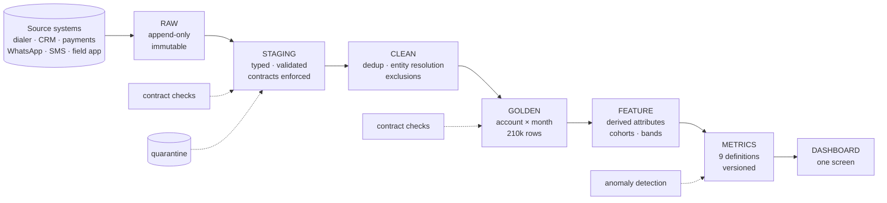

# Part 5 — Production Analytics Design

The point of this section is to turn a one-off analysis into something the leadership team can rely on every day.

One thing shapes the whole design. **Every failure we found was a definitional failure, not an engineering one.** The pipeline moved the data correctly. What went wrong is that the metric layer allowed an unnormalised figure with an unstated denominator to reach a leadership deck. So the central requirement here is that metric definitions live in versioned, tested code, not in the head of whoever wrote the query.

## The pipeline

| Layer | Grain | Stored as | Rebuild cost |
|---|---|---|---|
| Raw | Source record | Table, partitioned by ingest date | Never rebuilt |
| Staging | Source record, typed | View | Seconds |
| Clean | Source record, deduplicated | View | Seconds |
| Golden | account × month | Table | About 10 seconds |
| Feature | account × month | Table | Seconds |
| Metrics | month, and month by dimension | View | Instant |
| Dashboard | Presentation | Cached extract | Instant |

Clean is a view rather than a table on purpose. Cleaning rules change as new defects turn up, and a view means the change flows through on the next Golden build without a separate migration. Golden is materialised because it is the join-heavy step and everything downstream reads it over and over.

## Data contracts

Contracts are enforced at ingest and again at Golden. A violation fails the build. It does not write a warning into a log that nobody reads.

**Schema.** Required columns must be present and typed as declared. A new column gets admitted with a warning and an alert to the table owner. A disappearing column fails the build. Enum columns must hold known values only, and anything unknown gets quarantined with an alert.

That last rule earns its place here specifically. This dataset has PTP appearing 8 times in account_status_history.status against roughly 8,600 for every other value, which is a code leaking in from the disposition vocabulary. A contract catches that on day one instead of eight months later.

**Volume.** Daily row counts should sit within three standard deviations of the trailing 28-day mean. A zero-row day pages someone immediately. A duplicate rate above 0.5% on any primary key fails the build. For sizing, current baseline is around 2,150 events a day with a stable weekly shape.

**Referential integrity.** Every account_id in an event table must exist in accounts, which is currently 100% clean. agent_id must exist in the agent key list, also currently clean. borrower_id is contracted at a tolerance of 10% orphans rather than zero, because the current rate is 7 to 8% and a zero-tolerance contract would fail every build from day one. The contract encodes what we know and alerts when it gets worse.

## Primary keys

| Table | Key | Note |
|---|---|---|
| accounts | account_id | Unique, verified |
| borrowers | borrower_id | Not unique in source: 30,600 rows for 11,015 IDs. Resolved by latest updated_at |
| agents | none valid | 1,000 IDs with 14 to 48 conflicting rows each. Used as an opaque key only |
| payments | payment_id | 500 duplicates, deduplicated with a survivor rule |
| calls | call_id | 1,271 exact duplicates |
| call_attempts | attempt_id | |
| call_dispositions | disposition_id | |
| promises_to_pay | ptp_id | |
| daily_targeting | account_id + target_date + campaign_id | Composite |
| golden.account_month | account_id + month | Enforced by contract check |

payment_reference is explicitly not a key and must never be used as one. It comes from a pool of about 70,000 values and collides at exactly the rate random assignment predicts.

## Metric definitions

All nine live in `sql/03_metrics.sql`, which is the only place any of them is defined. No dashboard, notebook or ad-hoc query redefines a metric locally.

| Metric | Definition | Guardrail |
|---|---|---|
| Contact rate | connected ÷ total attempts, inside call_attempts | Cannot be computed across tables |
| RPC | right-party ÷ all dispositions, inside call_dispositions | Cross-table computation exceeds 100% |
| PTP rate | (PTP + PROMISE_TO_PAY) ÷ dispositions | Single-code definition halves it |
| PTP kept rate | kept ÷ created, cohorted by creation month | Cohorting by kept date distorts recent months |
| Recovery rate | paying accounts ÷ a named denominator | Denominator must appear in the column name |
| Recovery per account | rupees ÷ worked accounts | |
| Recovery per agent-hour | rupees ÷ session hours | Low statistical power, flag it in the UI |
| Cost per rupee recovered | Not computable | No cost field exists in any source |
| Channel conversion | Not measurable observationally | Needs randomised assignment |

Two rules come straight out of what went wrong, and neither is negotiable.

**Every rate column carries its denominator in the name.** So `recovery_rate_per_worked_pct`, never `recovery_rate`. The 11% claim was possible because a rate got reported without its denominator, and the denominator turned out to be the entire distortion.

**Every monthly series is published per calendar day alongside the absolute.** February to March reads +11.05% absolute and +0.28% per day. Publishing only the absolute makes calendar length indistinguishable from performance.

Metric definitions are versioned. Changing one increments a version and triggers a full backfill, so history is never quietly restated under a new rule.

## Lineage

Lineage is enforced by the numbered pipeline: 00_sources, then 01_clean, then 02_golden, then 03_metrics, then 04_forensics and 05_analysis. Each layer reads only from the one above it, and no file skips a layer.

Every cleaning rule carries a decision ID, D1 through D16, in a comment where it is applied. Those resolve to `output/decisions_log.md`, which records the rule, the evidence behind it, and its measured impact. Someone chasing an unexpected number goes metric, then golden column, then clean rule, then decision ID, then the forensic test that justified it.

At production scale this would be dbt, where `ref()` builds the DAG automatically and each model carries its own tests. The layers here map to dbt models one for one.

## Incremental processing

Event tables are append-only and partitioned by the date of event_at. Dimension tables are small and get fully refreshed.

A daily run ingests new source partitions into Raw, rebuilds the Clean views for free since they are views, rebuilds Golden for the affected months only, then rebuilds Metrics for free since those are views too.

At current volume none of that is necessary. The full Golden rebuild takes about ten seconds, and full-refresh is simpler and safer than incremental. **The incremental path should go in when the full rebuild passes roughly ten minutes, not before.** Incrementalising too early is a common source of quiet drift between partitions.

One useful property: because Golden is built from a cross join of accounts against months, rebuilding a single month is a clean partition replace with no risk of orphaned or missing account-months.

## Late-arriving data

This dataset shows the problem in miniature. account_status_history.recorded_at starts on 31 December 2025 while its event_at starts on 1 January 2026, so records arrive backdated. Five calls rows fall outside the stated window entirely.

Every event should carry both event_at, when it happened, and ingested_at, when we received it. Metrics compute on event_at; incremental logic keys on ingested_at.

Each daily run rebuilds the last seven days of partitions rather than only yesterday, so anything arriving up to a week late gets picked up automatically. Events arriving later than that go into a late_arrivals table and trigger a targeted partition rebuild plus an alert. They never get silently dropped. A restated_at column on the metrics table records when a historical figure last changed, so a number in last month's deck can be checked against the current value.

There is also a partial-period guard, which is not hypothetical here. The current month is always incomplete, so every monthly series must expose days_elapsed and days_in_month, and the dashboard must suppress or clearly mark any month where the two do not match. In this dataset, including the eight-day August partial month produces a −74.5% month-on-month reading.

## Backfills

A backfill gets triggered by a corrected cleaning rule, a changed metric definition, or a late-arriving batch.

Build into a shadow schema, never in place. Run the full contract suite against the shadow build. Then diff shadow against production on row counts, total recovery, and every published metric by month. If any published figure moves more than 0.5%, require explicit sign-off before promoting. Promote by atomic swap and keep the previous version for 30 days. Log the backfill with its reason, the decision ID that changed, and the before and after figures.

The diff step is the one that matters. Our own recovery_rate_per_worked definition moved from 22.99% to 12.31% when the denominator went from voice-only to all-channel. That was a legitimate correction, but promoted without a diff it would have silently restated history.

Backfills cost almost nothing at this scale, so there is no reason to skip the safe procedure.

## Data quality checks

Currently implemented as `golden.contract_checks` and run on every build. Any failure stops the build.

| Check | Type | Current |
|---|---|---|
| Row count equals accounts × months | Structural | PASS, 210,000 |
| Primary key unique | Structural | PASS |
| All accounts present in every month | Completeness | PASS, 30,000 |
| Expected month count | Completeness | PASS, 7 |
| No negative amounts | Validity | PASS |
| No null account attributes | Validity | PASS |
| Recovery reconciles to cleaned source | Reconciliation | PASS, ₹126.85 Cr |

The reconciliation check is the valuable one, because it proves the aggregation neither lost nor invented money. Every pipeline should have at least one end-to-end value reconciliation and not just structural tests.

For production we would add duplicate rate on every primary key with an alert above 0.5%, referential integrity per foreign key per run, null rate per column against its trailing baseline, and freshness measured as hours since the most recent event_at per source.

## Monitoring

| Signal | Threshold | Severity |
|---|---|---|
| Freshness, hours since last event per source | over 6 hours | Page |
| Volume, daily rows per table | outside 3 SD of trailing 28 days | Alert |
| Quality, contract check failures | any failure | Page, block publish |
| Distribution, null rate and enum mix | shift over 2 SD | Alert |
| Metric, any published figure | over 10% month-on-month | Alert, with per-day and per-denominator breakdown attached |

That last row is the direct operational fix for the failure this analysis found. An 11% month-on-month move should not be publishable without the calendar-normalised and denominator-explicit versions sitting next to it. With that guardrail in place, the claim would have refuted itself at the moment it was generated.

## Anomaly detection

Deliberately simple. The brief prefers a transparent method over an unexplainable model, and our findings support that empirically: no variable in this dataset predicts recovery, all correlations under 0.01 in absolute terms, so a learned anomaly model would have nothing to learn from and would produce alerts nobody could falsify.

The first tier is hard rules. Zero-volume day, contract failure, negative amount, duplicate key rate over threshold, future-dated event_at. Deterministic, no tuning, page immediately.

The second tier is statistical process control. A rolling z-score on daily volume and on each published metric, using a 28-day trailing window, flagging at absolute z above 3. Deliberately not seasonally decomposed, because this data shows no weekly seasonality at all and fitting seasonality to noise just creates false confidence.

The third tier is reconciliation drift: recovery as reported by the metrics layer against recovery summed directly from cleaned payments. Any divergence there is a pipeline bug by definition.

We explicitly reject ML-based anomaly detection. At roughly 2,150 events a day with no predictive structure, it would generate alerts nobody can explain or act on. If predictive structure gets established later through the randomised test we recommend, this decision is worth revisiting.

One discipline that is easy to skip: monitoring eight dimensions at a 2-sigma threshold produces about one false alert per run by chance. We hit exactly that pattern in the analysis, where risk segment, loan type and DPD all cleared 2 sigma and all three were noise. Alert thresholds have to be corrected for the number of series being monitored, or the on-call rotation learns to ignore them.

## Implementation

The current implementation is DuckDB over CSVs, chosen so that anyone can reproduce every figure with `pip install -r requirements.txt && python src/run_sql.py`.

For production the same SQL runs on any warehouse with very little change. We would use Airflow or Dagster for orchestration with one DAG per layer and contracts as task-level assertions, dbt for transformation with the six SQL files becoming models with ref() lineage and schema tests, a columnar warehouse with Golden partitioned by month, and metrics views exposed read-only.

**No BI tool may query below the metrics layer.** That is the rule to enforce hardest, because every metric definition problem in this analysis would have been prevented by it. A dashboard querying golden.account_month directly can invent its own denominator. A dashboard restricted to metrics.monthly cannot.
